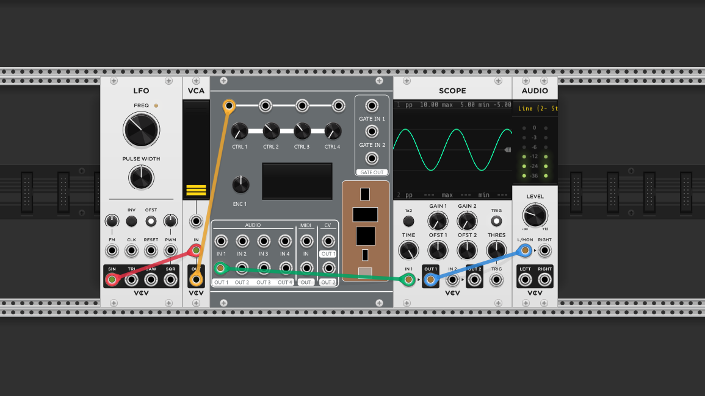

# Daisy Patch for VCV Rack

## What it is
VcvDaisyPatch is a VCV Rack module that mimics the inputs and outputs of the Electro-Smith Daisy Patch. It allows easy testing of patches in VCV Rack before uploading to the Daisy Patch hardware. The aspiration for this project is to be able to simply copy and paste your `AudioCallback` code from your Daisy Patch project into the VcvDaisyPatch module and have it work without modification.

## What it isn't
VcvDaisyPatch is not an emulator of the Daisy Patch hardware. If the module you are working on uses any of the Daisy Patch hardware features like GPIOs, external SDRAM or other peripherals, you will need to find a way to abstract those features in your code so that they can be tested in VCV Rack.

## How to use
The only files you should need to modify are plugin_impl.h and plugin_impl.cpp. These contain the implementation for your module. PluginImpl::Init() is called when the Vcv module is first created and is where you should initialize your module. PluginImpl::AudioCallback is where you should put your audio processing code and match the Daisy Patch AudioCallback function.

Alternatively, you can write a new class that inherits from PluginImpl and update vcv_patch.cpp to use your new class instead of PluginImpl.

## How to build
Follow the instructions for building VCV Rack plugins on the [VCV Rack website](https://vcvrack.com/manual/PluginDevelopmentTutorial.html). You will need to have the VCV Rack SDK installed and the `RACK_DIR` environment variable set to the location of the SDK.

Once your environment is set up, you can simply follow the VCV Rack instructions to build the plugin.

## What is working right now
- The 4 CV inputs (CTRL 1-4) and their corresponding knobs
- The 4 audio inputs (IN 1-4)
- The 4 audio outputs (OUT 1-4)

## What is not working right now
- The 2 gate inputs (GATE 1-2) and output (GATE OUT 1)
- Midi input and output
- Both CV outputs
- Encoder
- OLED display

## What is different from the Daisy Patch
- The samplerate is chosen by the user in the VCV Rack settings. Something to keep in my mind if your module depends on a specific samplerate.
- VCV Rack does per-sample processing, so the `AudioCallback` function is called once per sample. I'm hoping to implement a way to do block processing in the future.